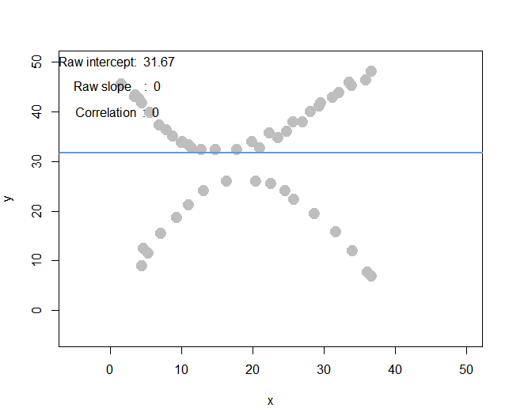
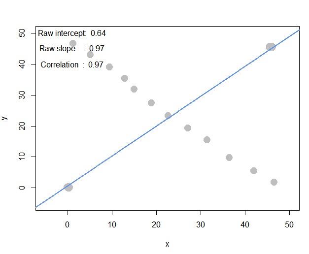

```{r setup, include=FALSE}
knitr::opts_chunk$set(echo = TRUE,fig.width=6, fig.height=4)
```

## Assist
+ Disscussed with `106000199`, and she helped me for
  + how to get a row/col in a matrix
  + how to rename a matrix

## Set up 

### import libary

```{r import, message=FALSE, warning=FALSE}
library(data.table)
library(lsa)
```


### Useful function
```{r}
# function provided by teacher
interactive_regression <- function() {
  cat("Click on the plot to create data points; hit [esc] to stop")
  plot(NA, xlim=c(-5,50), ylim=c(-5,50))
  points = data.frame()
  repeat {
    click_loc <- locator(1)
    if (is.null(click_loc)) break
    if(nrow(points) == 0 ) {
      points <- data.frame(x=click_loc$x, y=click_loc$y)
    } else {
      points <- rbind(points, c(click_loc$x, click_loc$y))
    }
    plot(points, xlim=c(-5,50), ylim=c(-5,50), pch=19, cex=2, col="gray")
    if (nrow(points) < 2) next
    
    model <- lm(points$y ~ points$x)
    abline(model, lwd=2, col="cornflowerblue")
    text(1, 50, paste(c("Raw intercept: ", round(model$coefficients[1], 2)), collapse=" "))
    text(1, 45, paste(c("Raw slope    : ", round(model$coefficients[2], 2)), collapse=" "))
    text(1, 40, paste(c("Correlation  : ", round(cor(points$x, points$y), 2)), collapse=" "))
  }
  
  return(points)
}
```


### Read File
```{r read file}
ac_bundles_dt <- fread("data/piccollage_accounts_bundles.csv")
ac_bundles_matrix <- as.matrix(ac_bundles_dt[, -1, with=FALSE])
```


## Q1 

### (a) explore sticker bundles

#### i. How many recommendations does each bundle have  

**ANSWER:** There are $6$ recommendations.


#### ii. Find a single sticker bundle, and recommend five other bundles in our dataset that might have similar usage patterns as this bundle.  


**ANSWER:** 

+ I Choose the bundle **doodleholiday**  
+ I guess the similar bundles: **washiholiday**, **hipsterholiday**, **jollyholiday**, **holidaycheers**, **pacmanholiday**


### (b) geometric models of similarity  


#### i. cosine similarity  

> Create a matrix or data.frame of the top 5 recommendations for all bundles  
Create a new function that automates the above functionality: it should take an accounts-bundles matrix as a parameter, and return a data object with the top 5 recommendations for each bundle in our data set, using cosine similarity.  
What are the top 5 recommendations for the bundle you chose to explore earlier?    

```{r cosine similarity}
# Create a new function
# return a top-k similar items
topK_similar <- function(M, k = 5){
  M_consine <- cosine(M)
  N <- NCOL(M) # how many items
  topK_martix <- t(sapply(1:N, 
                    function(x) {
                        names(sort(M_consine[x,], decreasing = TRUE)[2:(k+1)])
                      })) # the first will be itself
  rownames(topK_martix) <- colnames(M)
  colnames(topK_martix) <- sapply(1:k, function(x) {sprintf("Top%d",x)})
  topK_martix
} 
```


```{r}
ac_bundles_top5 <- topK_similar(ac_bundles_matrix)
ac_bundles_top5["doodleholiday",]
```

#### ii. correlation based recommendations

```{r}
ac_bundles_matrix_mc_col <- apply(ac_bundles_matrix, 2, 
                                  function(x) {x-mean(x)}) # 1:row op, 2:col op
ac_bundles_mc_col_top5 <- topK_similar(ac_bundles_matrix_mc_col)
ac_bundles_mc_col_top5["doodleholiday",]
```

#### iii. adjusted-cosine based recommendations

```{r}
ac_bundles_matrix_mc_row <- t(apply(ac_bundles_matrix, 1, 
                                    function(x) {x-mean(x)})) # 1:row op, 2:col op
ac_bundles_mc_row_top5 <- topK_similar(ac_bundles_matrix_mc_row)
ac_bundles_mc_row_top5["doodleholiday",]
```

### (c) (not graded)  Why and what differenct in these three sets of geometric recommendations and the recommendations you picked earlier using your intuition alone?

**ANSWER:** These three sets of geometric recommendations are totally same but different with my guess. The possible reason is the recommendations I picked are just a guess without any data.

### (d) (not graded)  What do you think is the conceptual difference in cosine similarity, correlation, and adjusted-cosine?

**ANSWER:**  

+ cosine similarity: Take the items as **vector**s, and defines the similarity between them as **the angle between these vectors** .  
+ correlation: The **difference in rating scale between different users are not taken into account.** To adjusted cosine similarity offsets this drawback, correlation is based on how much the ratings by common users for a pair of items deviate from average ratings for those items.  
+ adjusted-cosine: **Different users have different ratings schemes.** To adjusted cosine similarity offsets this drawback, 

## Q2 

### (a) Create a horizontal set of random points, with a relatively narrow but flat distribution.

**ANSWER:**   


+ I expect the slope will be around $0$.  
+ I expect the correlation will be around $0$.  
+ The result is similar to what I expected.  

### (b) 

**ANSWER:**   


+ I expect the slope will be around $0$.  
+ I expect the correlation will be around $0$.  
+ The result is similar to what I expected.


### (c)
**ANSWER:**   


+ I expect the slope will be around $1$.  
+ I expect the correlation will be around $1$.  
+ The result of correlation is similar to what I expected, and there is a little difference between $1$ and $0.76$. I think it just because the diagonal set I drew is not a perfect 45-degree trend.

### (d)
**ANSWER:**   


+ I expect the slope will be around $-1$.  
+ I expect the correlation will be around $-1$.  
+ The result is similar to what I expected. Notice the correlation should be $-1$ instaed of $1$ because they are **nagtive correlation**

### (e) Apart from any of the above scenarios, find another pattern of data points with no correlation ($r\approx 0$). 

> (optionally: can create a pattern that visually suggests a strong relationship but produces $r\approx 0$ ?)

**ANSWER:**   

  

+ As the diagonal showed, we can see there are two curve relation.   
+ However, the correlation is $0$.

### (f) Apart from any of the above scenarios, find another pattern of data points with perfect correlation ($r\approx 1$).  

> (optionally: can you find a scenario where the pattern visually suggests a different relationship?)

**ANSWER:**   



### (g)

Because `interactive_regression` can't run in Rmarkdown knit, we have to run these commands in console and save the variables `pts`.


```r
pts <- interactive_regression() 
saveRDS(pts, file = "W:/Rtmp/pts.rds")
```


```{r}
pts <- readRDS(file = "W:/Rtmp/pts.rds")
summary( lm( pts$y ~ pts$x ))
pts["Normilized_x"] <- as.data.frame(scale(pts$x))
pts["Normilized_y"] <- as.data.frame(scale(pts$y))
cor(pts)
```
**ANSWER:** The relationship between correlation and the standardized simple-regression estimates are totally same.


## Reference Link
+ [The Number of Rows/Columns of an Array](https://stat.ethz.ch/R-manual/R-devel/library/base/html/nrow.html)
+ [Matrix Function in R – Master the apply() and sapply() functions in R](https://data-flair.training/blogs/r-matrix-functions/)
+ [Named Vectors](https://rpubs.com/sowmya21jan/338762)
+ [R - order(),sort(),rank()](https://blog.csdn.net/u012543538/article/details/16340907)
+ [Extract matrix column values by matrix column name](https://stackoverflow.com/questions/5744694/extract-matrix-column-values-by-matrix-column-name)
+ [Working with data in a matrix](https://monashbioinformaticsplatform.github.io/r-intro/matrices.html)
+ [Correlation Coefficient](https://johnmayhk.wordpress.com/2008/08/07/correlation/)
+ [Item-based collaborative filtering](https://www.cs.carleton.edu/cs_comps/0607/recommend/recommender/itembased.html)
+ [Adjusted Cosine Similarity](http://www.www10.org/cdrom/papers/519/node14.html)
+ [R saveRDS Function](http://www.endmemo.com/r/saverds.php)
