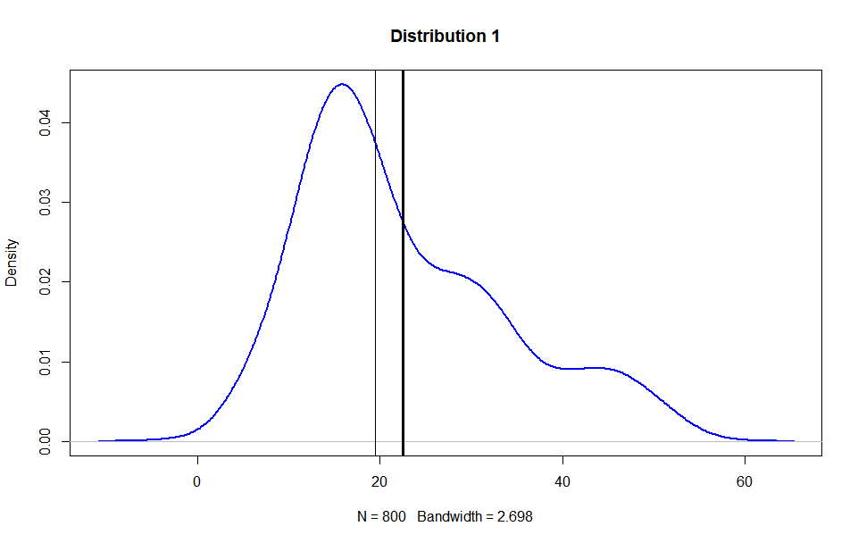

# HW3 (Week3)
+ [Questions Document](https://docs.google.com/document/d/1Jqvp7O3NCXNNgkc4P-_NXhaYP1XDw9uGQYngsaDAgXg/edit)

## 重點整理(統計)
### 偏態

+ 正偏=右偏，負偏=左偏
+ **常見盲點**：偏態是根據佔用x的範圍而非資料集中的方向，所以左偏資料會主要集中在右側，反之亦然。

## 重點整理(程式)
### 繪製分佈+標注平均/中位數
```r
dist_show <- function(dist,number=1,plot_mean=TRUE,plot_median =TRUE){
  plot(density(dist), col="blue", lwd=2,
       main = paste("Distribution",number))
  if(plot_mean){
    abline(v=mean(dist),lwd=3)
  }
  if(plot_median){
    abline(v=median(dist),lwd=1.5)
  }
}
dist_show(d123)
```



### 計算hist的bins數量
```r
nclass.Sturges(data)
nclass.scott(data)
nclass.FD(data)
```

## 延伸資料
+ [nclass](https://www.rdocumentation.org/packages/grDevices/versions/3.6.2/topics/nclass)
+ [sprintf not ouput?](https://d.cosx.org/d/420562-sprintf-r)
+ [Skewness](https://zh.wikipedia.org/wiki/%E5%81%8F%E5%BA%A6)
+ [R Markdown](https://bookdown.org/xiao/RAnalysisBook/r-markdown.html#section-5.6.3)
+ [wwweiwei/Business-Analytics-Using-Computational-Statistics/HW3/HW3.Rmd](https://github.com/wwweiwei/Business-Analytics-Using-Computational-Statistics/blob/master/HW3/HW3.Rmd)
