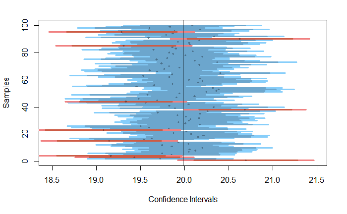

# HW3 (Week4)

+ [Questions Document](https://docs.google.com/document/d/10_bAlm1sAQRDshnx-Iz1p40tpeMFhsOs9wt1H42Vr4M/edit)

## 重點整理(統計)
##### 已知$\sigma$樣本估計母體平均
+ Z dist
+ $\mu\approx\bar{x}\pm z_{\alpha/2}\frac {\sigma}{\sqrt n}$
##### 估計母體標準差
+ Chi-Square dist
+ 左右不等長，故需分開計算
  + $LCL=\frac{(n-1)s^2}{\chi^2_{n-1,\alpha/2}}$  
  + $UCL=\frac{(n-1)s^2}{\chi^2_{n-1,1-\alpha/2}}$  
##### 有限母體標準偏差修正
+ $\sigma_{\bar {x}}=\sqrt{\frac{N-n}{N-1}}\frac{\sigma}{\sqrt{n}}$

## 重點整理(程式)

### 抽樣產生信賴區間偏差Visualize
+ [Sample code](https://gist.github.com/soumyaray/285296600b8712b04b52201010bbbd9f)

```r
# Visualize the confidence intervals of samples drawn from a population
#   e.g.,
#     visualize_sample_ci(sample_size=300, distr_func=rnorm, mean=50, sd=10)
#     visualize_sample_ci(sample_size=300, distr_func=runif, min=17, max=35)
visualize_sample_ci <- function(num_samples = 100, sample_size = 100,
                                pop_size=10000, distr_func=rnorm, ...) {
  # Simulate a large population
  population_data <- distr_func(pop_size, ...)
  pop_mean <- mean(population_data)
  pop_sd <- sd(population_data)

  # Simulate samples
  samples <- replicate(num_samples,
                       sample(population_data, sample_size, replace=FALSE))

  # Calculate descriptives of samples
  sample_means = apply(samples, 2, FUN=mean)
  sample_stdevs = apply(samples, 2, FUN=sd)
  sample_stderrs <- sample_stdevs/sqrt(sample_size)
  ci95_low  <- sample_means - sample_stderrs*1.96
  ci95_high <- sample_means + sample_stderrs*1.96
  ci99_low  <- sample_means - sample_stderrs*2.58
  ci99_high <- sample_means + sample_stderrs*2.58

  # Visualize confidence intervals of all samples
  plot(NULL, xlim=c(pop_mean-(pop_sd/2), pop_mean+(pop_sd/2)),
       ylim=c(1,num_samples), ylab="Samples", xlab="Confidence Intervals")
  add_ci_segment(ci95_low, ci95_high, ci99_low, ci99_high,
                 sample_means, 1:num_samples, good=TRUE)

  # Visualize samples with CIs that don't include population mean
  bad = which(((ci95_low > pop_mean) | (ci95_high < pop_mean)) |
              ((ci99_low > pop_mean) | (ci99_high < pop_mean)))
  add_ci_segment(ci95_low[bad], ci95_high[bad], ci99_low[bad], ci99_high[bad],
                 sample_means[bad], bad, good=FALSE)

  # Draw true population mean
  abline(v=mean(population_data))
}

add_ci_segment <- function(ci95_low, ci95_high, ci99_low, ci99_high,
                           sample_means, indices, good=TRUE) {
  segment_colors <- list(c("lightcoral", "coral3", "coral4"),
                         c("lightskyblue", "skyblue3", "skyblue4"))
  color <- segment_colors[[as.integer(good)+1]]

  segments(ci99_low, indices, ci99_high, indices, lwd=3, col=color[1])
  segments(ci95_low, indices, ci95_high, indices, lwd=3, col=color[2])
  points(sample_means, indices, pch=18, cex=0.6, col=color[3])
}
```
##### 繪圖結果：


### 繪圖

### ggplot
```r
p <- ggplot(mapping = aes(norm_1))
p + geom_histogram(bins=nclass.Sturges(norm_1))
p + geom_area(stat = "density", fill = "cadetblue2")
```


### 子圖
```r
par(mfcol=c(1,2))
```


### 計算

#### 信賴區間CI
```r
CI <- quantile(data, probs=c(0.025, 0.975)) # 95% confidence
```  


## 延伸閱讀
+ [Sample and distribution](http://web.cjcu.edu.tw/~jdwu/stat01/lect002.pdf)
+ [ggplot](https://www.math.pku.edu.cn/teachers/lidf/docs/Rbook/html/_Rbook/ggplot2.html#ggplot2-right-facet)
