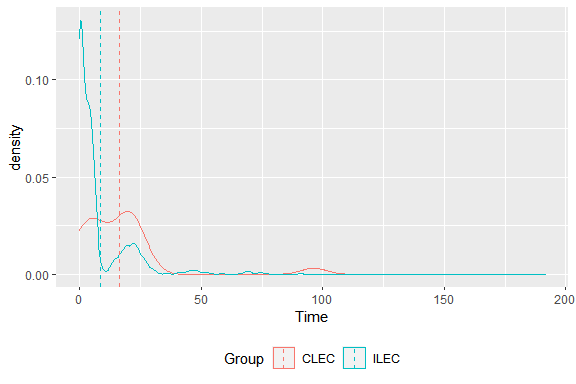
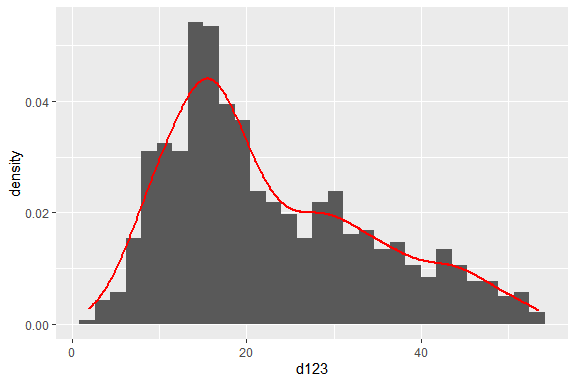

# HW6

## 重點整理(統計)
### 虛無假設
+ H_0: 虛無假設
  + 一般是希望是錯的的假設
+ H_1: 對立假設


### 假設檢定
#### T-test
+ 檢驗單樣本的母體均值
+ 檢驗兩樣本母體差之均值
  + 前提：已知兩母體標準差相同

#### F-test
+ 檢驗單樣本某自變數是否具有解釋能力
+ 檢驗兩樣本母體標準差是否相同


## 重點整理(程式)
### DataFrame篩選方式
```R
ILEC <- verizon[verizon$Group == "ILEC",]
CLEC <- verizon[verizon$Group == "CLEC",]
```
注意，和Python Pandas不同的地方在於index需要加一個`,`

### 根據組別繪製不同顏色的分佈圖(ggplot)
```R
# 取得各組平均
verizon_time_mu <- ddply(verizon, "Group", summarise, grp.mean=mean(Time))

# 繪圖
p <- ggplot(verizon, aes(x=Time, color=Group)) +
  geom_density() +
  geom_vline(data=verizon_time_mu, aes(xintercept=grp.mean, color=Group),
             linetype="dashed") +
  theme(legend.position="bottom")
p
```


+ ggplot畫Dataframe格式資料
  + `ggplot()`中的`aes`設定使用各軸名稱
+ `verizon`為一個`data.frame`
  + `Group`為各組類別名稱，此處為：`ILEC`和`CLEC`
  + `Time`為資料數值，為本次X軸


### 同時繪製density和hist(ggplot)
```R
p <- ggplot(mapping = aes(d123)) +
  geom_histogram(mapping = aes(y = stat(density))) +
  geom_density(color = "red", size = 1)
p
```


+ ggplot畫一個array的資料
  + `ggplot()`中要直接適用`mapping=aex($array_name)`
+ `d123`為一個`array`
+ > 這種畫法比較不優美，但比較直觀就是分別畫每一張圖


### QQplot

#### 內建繪圖
```
norm_qq_plot <- function(values){
  probs1000 <- seq(0, 1, 0.001)
  q_vals <- quantile(values, probs = probs1000)
  q_norm <- qnorm(probs1000, mean = mean(values), sd = sd(values))
  plot(q_norm, q_vals, xlab="normal quantiles", ylab="values quantiles")
  abline( a = 0, b = 1 , col="red", lwd=2)
}
```

#### 使用ggplot
```R

norm_qq_ggplot <- function(values){
  df <- data.frame(value=values)
  gg <- ggplot(data = df, mapping = aes(sample = value)) +
      stat_qq_band() +
      stat_qq_line() +
      stat_qq_point() +
      labs(x = "Theoretical Quantiles", y = "Sample Quantiles")
  gg
}
```


## Reference
+ [ggplot2 density plot](http://www.sthda.com/english/wiki/ggplot2-density-plot-quick-start-guide-r-software-and-data-visualization)
+ [qqplotr](https://cran.r-project.org/web/packages/qqplotr/readme/README.html)
+ [How to interpret a QQ plot](https://stats.stackexchange.com/questions/101274/how-to-interpret-a-qq-plot?fbclid=IwAR04svi9CyQe10jAcMgI9WXMjmLvuNKI9iGHFBKJ4BWLxtw6K2V4mP3J0UY)
