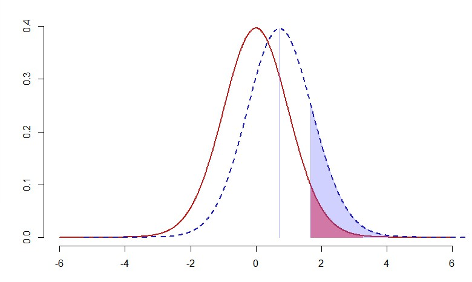

# HW9
+ [Questions Document](https://docs.google.com/document/d/1Utpugh96-nV0WvJimC1TvUI7HSgKPzRyV2OLepqrHC0/edit)

## 重點整理(統計)
### Type1 error and Type2 error
+ 
  + > from [Wiki: Type I and type II errors](https://en.wikipedia.org/wiki/Type_I_and_type_II_errors)
+ 
  + 紅色實線為母體
  + 藍色虛線為樣本
+ Type1
  + 錯殺：不應拒絕而拒絕(FP)
  + 比較嚴重，通常先設定此比例為α
    + 圖中紅色區塊
+ Type2
  + 漏殺：應該拒絕而沒拒絕(FN)
  + 先考慮母體已在紅色區塊(應該拒絕)，而樣本沒有拒絕
    + 圖中藍色線的白色區塊

## 重點整理(程式)
### R互動式繪圖——Manipulate
##### 使用效果

##### [範例程式](t_power.R)

## 延伸資料
+ [Random vs Systematic Error](https://www.physics.umd.edu/courses/Phys276/Hill/Information/Notes/ErrorAnalysis.html)
+ [Interactive Plotting with Manipulate](https://support.rstudio.com/hc/en-us/articles/200551906-Interactive-Plotting-with-Manipulate)
